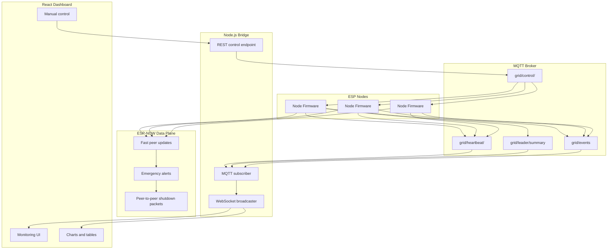

# EdgeGrid Hybrid Dashboard

EdgeGrid Hybrid Dashboard is a distributed smart-grid prototype built with ESP nodes, MQTT, ESP-NOW, a Node.js bridge, and a React dashboard.

It combines:

- MQTT for reliable control, summaries, and event publishing
- ESP-NOW for fast peer-to-peer communication between nodes
- a backend bridge for WebSocket streaming and manual control
- a dashboard for live monitoring, visualization, and operator control

## Highlights

- Real-time node telemetry: load, temperature, vibration, status
- Hybrid communication model: MQTT + ESP-NOW
- Automatic leader election using MAC-based priority
- Self-healing re-election when the leader fails or disappears
- Automatic load shedding and restore logic
- Manual shutdown and restore from the dashboard
- Live event stream and communication metrics

## How The Project Works

Each ESP node reads local sensor data and publishes heartbeat messages to MQTT. Nodes also exchange fast peer updates over ESP-NOW.

One active node becomes the leader. The leader:

- monitors node heartbeats
- aggregates total active load
- publishes `grid/leader/summary`
- detects warning and overload conditions
- decides which node to shut down or restore

The Node.js bridge subscribes to `grid/#`, forwards MQTT messages to the browser over WebSocket, and exposes a REST endpoint for manual control.

The React dashboard connects to the bridge and shows the current grid state, node state, events, and communication performance.

## Architecture

`ESP nodes -> MQTT broker -> backend/mqtt-bridge.js -> WebSocket + REST -> React dashboard`



## Self-Healing and Dynamic Leader Re-Election

The system does not rely on one fixed controller node.

Each node watches leader heartbeats. If the current leader is no longer seen within the firmware timeout window, followers automatically start leader election.

Leader election is deterministic:

- only active, non-shutdown nodes are eligible
- the node with the lowest MAC address becomes leader
- nodes wait for a short backoff, then re-check eligibility before claiming leadership

Re-election can happen when:

- the leader stops publishing heartbeats
- the leader is shut down automatically during overload handling
- the leader is shut down manually from the dashboard
- a lower-MAC eligible node appears and the current leader is no longer the correct leader

Once elected, the new leader immediately resumes summary publishing and load-management decisions. The dashboard updates automatically as soon as it receives summaries from the new leader.

## Functional Split

### Control Plane

Responsible for cluster-level decision making:

- leader election
- MQTT heartbeats
- load aggregation
- overload detection
- automatic load shedding
- automatic restore logic
- leader summary publishing
- backend event publishing

### Data Plane

Responsible for fast communication outside MQTT:

- ESP-NOW fast broadcasts
- emergency alerts
- peer-to-peer shutdown packets
- reachability indication
- fallback behavior when MQTT or ESP-NOW is degraded

### Device Logic and Actuation

Responsible for node-local sensing and execution:

- load reading
- temperature reading
- vibration reading
- maintaining node state
- executing shutdown and restore commands
- safe fallback when sensors or communication paths fail

## Why These Components Were Used

### ESP8266 / ESP32-Class Board

Chosen for Wi-Fi support, ESP-NOW support, low cost, and suitability for multi-node distributed control.

### Potentiometer

Used to simulate electrical load in a simple, controllable, repeatable way during demonstrations.

### DHT11

Used for basic temperature monitoring and threshold-based alerts.

### MPU6050

Used to detect vibration and support condition-monitoring behavior in addition to energy monitoring.

### Relay

Used as the final actuation element to apply shutdown and restore decisions physically at node level.

## Repository Structure

```text
edgegrid-dashboard/
|-- backend/
|   |-- mqtt-bridge.js
|   `-- test-server.js
|-- dashboard/
|   |-- dist/
|   |-- index.html
|   |-- postcss.config.js
|   |-- tailwind.config.js
|   |-- vite.config.js
|   `-- src/
|       |-- api/
|       |-- components/
|       |-- hooks/
|       |-- pages/
|       |-- App.jsx
|       |-- index.css
|       `-- main.jsx
|-- firmware/
|   `-- arduino/
|       `-- eap8266.ino
|-- .env
|-- package.json
`-- README.md
```

## Tech Stack

- Firmware: Arduino C++ for ESP8266 / ESP32-class boards
- Messaging: MQTT and ESP-NOW
- Backend: Node.js, Express, ws, mqtt
- Frontend: React, Vite, Tailwind CSS, Recharts

## Setup

### Prerequisites

- Node.js 18+
- npm 9+
- MQTT broker reachable from your machine
- ESP firmware publishing under `grid/#`

### Install

```bash
npm install
```

### Environment

Root `.env`:

```env
VITE_WS_URL=ws://localhost:3001
VITE_API_URL=http://localhost:3001
```

Note:

- frontend URLs come from `.env`
- the MQTT broker URL is currently hardcoded in [backend/mqtt-bridge.js](backend/mqtt-bridge.js)

## Run

Use two terminals.

### 1. Start the bridge

```bash
npm run mqtt-bridge
```

### 2. Start the dashboard

```bash
npm run dev
```

Open:

- `http://localhost:5173`

## Available Scripts

- `npm run dev` - start dashboard dev server
- `npm run build` - build dashboard into `dashboard/dist`
- `npm run preview` - preview production build
- `npm run mqtt-bridge` - start MQTT/WebSocket bridge
- `npm run test-server` - start optional mock backend for UI testing

## MQTT Topics

The project uses these main topics:

- `grid/heartbeat/<node-id>`
- `grid/leader/summary`
- `grid/events`
- `grid/control/<node>`

## Manual Control API

Bridge endpoint:

- `POST /control`

Example request:

```json
{
  "node": "Node-1",
  "action": "SHUTDOWN",
  "manual": true
}
```

Supported actions:

- `ON` or `RESTORE`
- `OFF` or `SHUTDOWN`

## Common Issues

### Nodes disappear after dashboard refresh

Usually this means the dashboard is not receiving fresh `grid/leader/summary` packets yet.

Check:

1. the bridge is connected and subscribed to `grid/#`
2. the leader is actively publishing `grid/leader/summary`
3. `VITE_WS_URL` points to the correct bridge host

### Manual control does not work

Check:

1. `VITE_API_URL` points to the bridge
2. the bridge is running on port 3001
3. node IDs in the UI match the IDs used in MQTT topics

### Bridge receives no MQTT data

Check:

1. broker IP and port in [backend/mqtt-bridge.js](backend/mqtt-bridge.js)
2. broker reachability on the network
3. firmware is publishing under `grid/#`

## Build for Production

```bash
npm run build
npm run preview
```

Production output:

- `dashboard/dist`

## License

MIT
